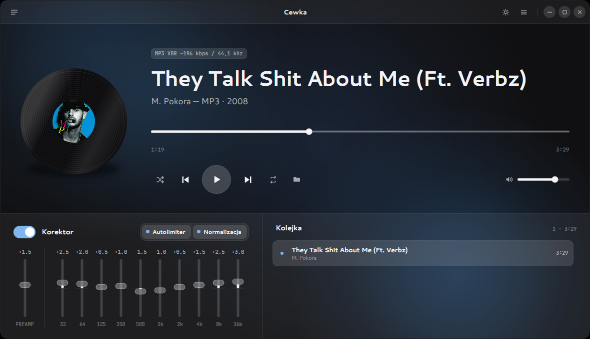
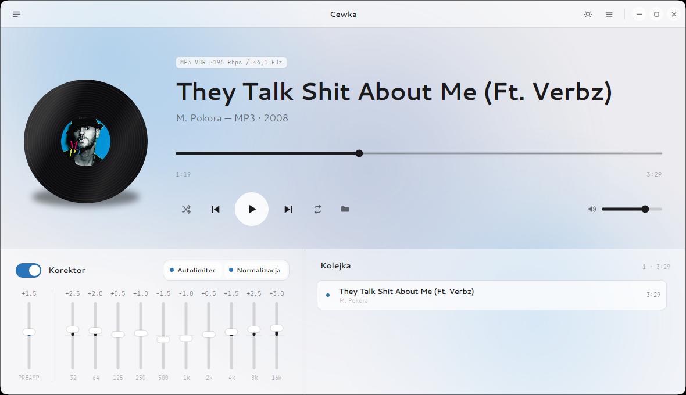
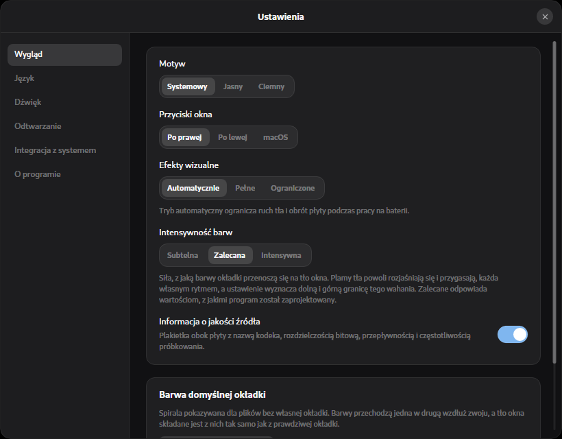

# Cewka

A minimalist music player for Linux and Windows. A single file, no installer,
no .NET runtime required.


*[Wersja polska](README.md)*





## Why I built this

I couldn't find a configurable, good-looking music player for my Fedora setup, so I wrote one
myself. I wanted something that just plays files from disk, has an equalizer, and looks good —
no library, no account, no service integrations.

I wrote the code with help from Claude Code, which wrote automated tests and hunted for bugs.

## What Cewka can do

- **Formats**: MP3, FLAC, WAV, Ogg Vorbis, Opus, and through system codecs also AAC, M4A, and ALAC
- **Gapless playback** and click-free seeking
- **Ten-band equalizer** with a preamp and a soft limiter on the output
- **Volume normalization** using ReplayGain tags or its own EBU R128 analysis, with a choice
  of target level (−23, −18, or −14 LUFS)
- **M3U playlists** — the queue can be saved and loaded, including in another player
- **Background from cover art colors**, animated to the beat; the blobs breathe independently
  of one another, and the colour intensity has three settings
- **Light and dark theme**, following the system by default
- **Seventeen languages**: Polish, English, Czech, German, Greek, Spanish, French, Hungarian,
  Indonesian, Italian, Dutch, Portuguese, Romanian, Russian, Turkish, Ukrainian, and Vietnamese
- **Desktop integration**: media panel (MPRIS on Linux, an overlay on Windows),
  media keys, single instance with file handoff
- **Update check** — on demand or at start-up, off by default. This is the only place the
  application touches the network: one question to GitHub for the number of the latest
  release, no more than once a day
- **Settings**: output device, buffer size, sample rate conversion quality, seek step,
  restoring the previous session, default cover colours (five pairs, or a fresh one for every
  track), what happens to a file opened from the file manager



## Installation

Packages are on the [releases page](https://github.com/grelix/cewka/releases). After installation
the app shows up in the application menu.

**Fedora, RHEL, openSUSE**

```bash
sudo dnf install ./cewka-0.7.11-1.x86_64.rpm
```

**Debian, Ubuntu, Linux Mint**

```bash
sudo apt install ./cewka_0.7.11_amd64.deb
```

**Arch, Manjaro**

```bash
sudo pacman -U cewka-0.7.11-1-x86_64.pkg.tar.zst
```

**Windows**

Just download `Cewka.exe` and run it. No installer needed.

### AAC, M4A, and ALAC on Linux

These three formats are handled by GStreamer, and the AAC decoder comes from a separate package.
Without it the other formats work fine.

```bash
sudo dnf install gstreamer1-libav        # Fedora (from RPM Fusion)
sudo apt install gstreamer1.0-libav      # Debian, Ubuntu
sudo pacman -S gst-libav                 # Arch
```

## Keyboard shortcuts

| Shortcut | Action |
|-------|-----------|
| `Space` | Play or pause |
| `←` `→` | Seek (step configurable in settings: 5, 10, or 30 s) |
| `Ctrl` + `←` `→` | Previous or next track |
| `↑` `↓` | Volume |
| `M` | Mute |
| `Q` | Equalizer and queue |
| `T` | Switch theme |
| `F11` | Fullscreen |
| `Ctrl+O` | Add files |
| `Ctrl+Shift+O` | Add folder |
| `Delete` | Remove from queue |

Media keys on the keyboard also work when the window isn't focused.

## Building from source

You need .NET SDK 9 and a C compiler — `gcc` on Linux or Visual Studio Build Tools
on Windows.

```bash
./native/build-linux.sh
```

Then the app:

```bash
dotnet run --project src/Cewka.App -- ~/Music/Album
```

Single-file release and installer packages:

```bash
./tools/publish-linux.sh
./tools/build-packages.sh
```

On Windows the equivalents are `native\build-windows.cmd` and `tools\publish-windows.cmd`.

### Tests

```bash
dotnet test Cewka.sln
```

326 tests: signal processing, view model logic, settings compatibility across versions,
and completeness of the language files.

UI screenshots can be rendered without opening a window — useful for comparing
successive versions of the look:

```bash
dotnet run --project tools/Cewka.Snapshots -- artifacts/snapshots
```

Passing an audio file as the second argument feeds it into the window exactly as opening it from
the file manager would — with title, cover art and duration. Every animation is stopped at a
fixed point while capturing, so two runs of the same code produce the same images and they can
be compared pixel by pixel:

```bash
dotnet run --project tools/Cewka.Snapshots -- artifacts/snapshots ~/Music/Album/track.mp3
```

You don't need music of your own for this. The tool can produce the material itself — two files
of different lengths, computed from trigonometric functions, so they come out byte-identical
every time:

```bash
dotnet run --project tools/Cewka.Snapshots -- --material artifacts/material
```

Besides drawing, the tool runs three behavioural checks: whether the "Equaliser" and "Queue"
headings sit on the same line, whether the window returns to its previous height after the panel
is collapsed, and whether replacing the queue with a file opened from outside plays that file.
The checks alone, without drawing, take seconds:

```bash
dotnet run --project tools/Cewka.Snapshots -- artifacts/snapshots long.wav short.wav --sprawdzenia
```

The look can also be compared against [reference images](tests/odniesienie/README.md). Where they
differ, a difference image is written with the differing pixels marked in red:

```bash
dotnet run --project tools/Cewka.Snapshots -- artifacts/snapshots long.wav short.wav --porownaj tests/odniesienie
```

### Continuous builds

Every change on the main branch compiles the native layer, runs the tests and renders the
screenshots with the reference comparison — separately on Linux and on Windows.

Releases are built from a pushed `vX.Y.Z` tag. The pipeline first checks that the tag matches
`<Version>` in `Directory.Build.props`, builds the packages, installs them in Ubuntu, Fedora and
Arch containers, and then creates a **draft** release with the files and their checksums. The
release notes are written by hand and publishing is a deliberate act.

The installation trials can be run locally too, if docker is available:

```bash
./tools/test-packages.sh
```

## Known limitations

- All three packages are verified by installation on every change — in Ubuntu 24.04, current
  Fedora and Arch containers. The trial covers installing, the validity of the menu entry, the
  full set of icons, dependency resolution, running the app under a headless X server, and
  uninstalling without leftovers. A container is not a desktop, though: it says nothing about
  how the app looks or sounds.
- The Arch package is built without `makepkg`, so it has no `.MTREE` file. `pacman -U` accepts
  it, though it may mention this. The repository also has [`PKGBUILD`](packaging/arch/PKGBUILD).
- The effects-throttling mode on battery hasn't been tested on a laptop.
- The "low latency" setting is only a hint to the driver. In WASAPI shared mode it doesn't
  always change anything — the settings window then shows the size the device actually accepted.

## How it's built

C# and [Avalonia UI](https://avaloniaui.net/), audio through [miniaudio](https://miniaud.io/)
with a custom interop layer. Decoders: miniaudio for MP3, FLAC, and WAV,
[NVorbis](https://github.com/NVorbis/NVorbis) for Ogg Vorbis,
[Concentus](https://github.com/lostromb/concentus) for Opus, and for the remaining formats
Media Foundation on Windows and GStreamer on Linux.

## License

MIT — full text in [LICENSE](LICENSE). The embedded Cantarell and JetBrains Mono fonts are
licensed under the SIL Open Font License 1.1; details in [docs/licencje.md](docs/licencje.md)
(in Polish).
